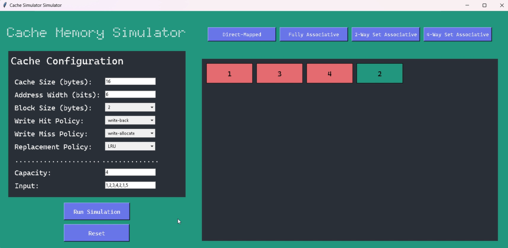

# 🌟 Cache Memory Simulator 🌟

## 👀 Overview
🌝 The **Cache Memory Simulator** is an interactive graphical user interface (GUI) tool designed to model the behavior of various cache memory configurations. Built using Python's `tkinter` library, this simulator allows users to adjust cache settings, input memory access sequences, and run simulations to understand how different cache mapping techniques—such as **Direct-Mapped**, **Fully Associative**, **2-Way Set Associative**, and **4-Way Set Associative**—handle memory operations. Additionally, it supports various replacement policies to analyze their impact on cache performance.

🌚Through this simulator, users can visualize cache hits and misses in real-time, enabling a deeper understanding of how different configurations, including cache size, address width, block size, and more, influence system performance. As users perform operations like load and store, the simulator provides immediate feedback with visual cues, indicating cache hits, misses, and data modifications in both the cache and memory.

🌛This tool is ideal for educational purposes or performance analysis, allowing users to observe how cache management strategies affect memory access patterns and optimize performance.

---

## ☄️ Features

- **🧑‍💻 User Interface**: 
  - Developed using Python's `tkinter`, providing an easy-to-use, interactive platform to configure and simulate cache memory systems.
  
- **💾 Cache Algorithms Supported**: 
  - **Direct-Mapped Cache**
  - **Fully Associative Cache**
  - **2-Way Set Associative Cache**
  - **4-Way Set Associative Cache**
  
- **⚙️ Cache Configuration Options**:
  - Cache size
  - Address width
  - Block size
  - Write hit policy
  - Write miss policy
  - Replacement policy
  - Cache line capacity

- **🧠 Input Types**:
  - **LOAD** instructions: Input memory addresses in hexadecimal format (e.g., `0x1A3,0x4B2`), where each address is separated by a comma.
  - **STORE** instructions: Input memory address-data pairs in hexadecimal format (e.g., `0x1A3-0xFF,0x4B2-0xAB`), where each pair is separated by a comma.

- **🎨 Visual Feedback**:
  - Cache memory states are displayed in real-time, indicating cache hits and misses, and showing the modifications of data in both the cache and memory.

---
## 🌷 Screenshots 

|  Load - Direct mapped Configuration|  Cache Miss - 2-Way Set  |
| :------------: | :------------: |
| |   |
|  Cache Hit - Fully Associative Configuration| Testing LRU algorithm |
|  |   |


---
## 🔍 Prerequisites

To run this simulator, you'll need:

- Python 3.x installed on your machine
- `tkinter` library (usually included with Python by default)
- No additional dependencies are required for the core functionality.

## 💆‍♀️ Installation

1. Clone the repository:
   ```bash
   git clone https://github.com/ralucaand03/CacheMemorySimulator.git
2. Navigate to the project directory:
   ```bash
    cd CacheMemorySimulator
3. Run the simulator using:
     ```bash
     python main.py

---

## 🧑‍💻 Usage
- **LOAD Operation:**

For loading values into the cache, input memory addresses in the form address1,address2,....

- **STORE Operation:**

For storing data at specific memory addresses, input memory address-data pairs in the form address1-data1,address2-data2,....

---

## 💡 Tips
Ensure that the input format strictly follows the hexadecimal address and data format to avoid any errors during simulation.
Adjust the cache parameters (e.g., cache size, block size) to explore different configurations and observe how they affect cache performance.


